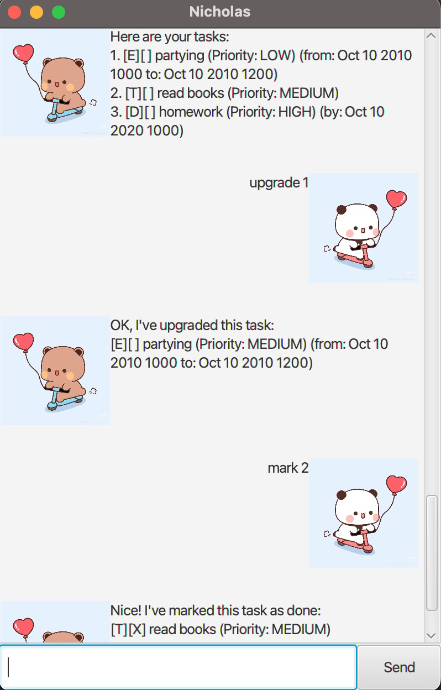

# Nicholas User Guide

Nicholas is a chatbot that is capable of helping you organise your daily tasks.

## 📖 Usage Guide

### :gem: Available Commands

| Command                                                      | Description                                                                                                                                     |
|--------------------------------------------------------------|-------------------------------------------------------------------------------------------------------------------------------------------------|
| `list `                                                      | List out all the tasks (both done and undone) that you have added.                                                                              |
| `mark <task_number>`                                         | Mark the task at <task_number> in the list as done.                                                                                             |
| `unmark <task_number>`                                       | Unmark the task at <task_number> as undone.                                                                                                     |
| `find <task_prefix>`                                         | Find all the tasks that contain <task_prefix> in its description and list them out.                                                             |
| `delete <task_number>`                                       | Delete the task at <task_number> in the list.                                                                                                   |
| `upgrade <task_number>`                                      | Upgrade the task at <task_number> by one level of priority.                                                                                     |
| `downgrade <task_number>`                                    | Downgrade the task at <task_number> by one level of priority.                                                                                   |
| `todo <task_description>`                                    | Add a task of type 'todo' which has no date specification to the list.                                                                          |
| `deadline <task_description> /by <deadline>`                 | Add a task of type 'deadline' which has an end date specification to the list. Date needs to be in "yyyy-MM-dd HHmm" format.                    |
| `event <task_description> /from <start_date> /to <end_date>` | Add a task of type 'deadline' which has both a start date and end date specification to the list. Dates need to be in "yyyy-MM-dd HHmm" format. |
| `bye`                                                        | Ends the conversation with the chatbot.                                                                                                         |

